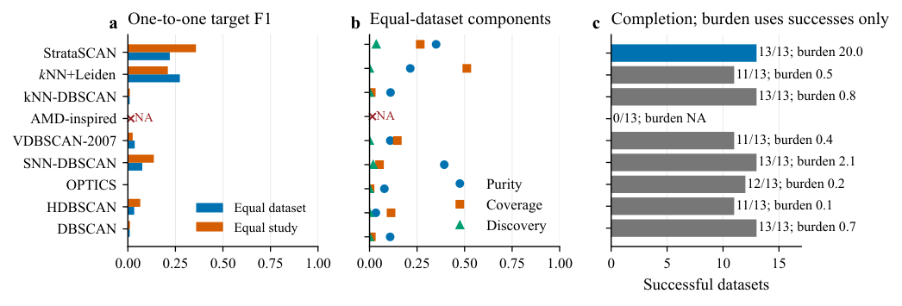
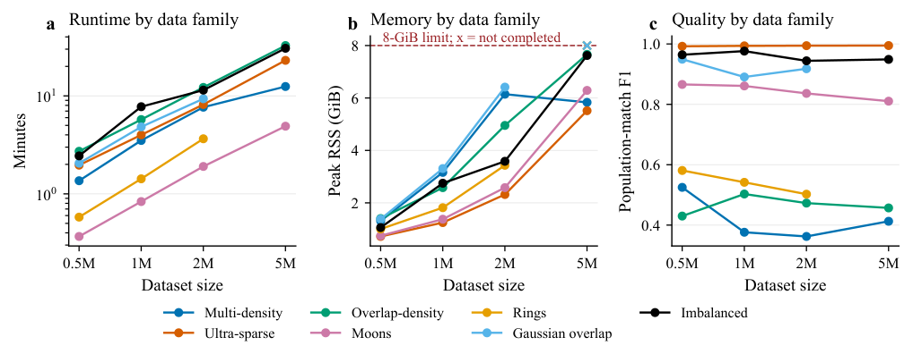

# StrataSCAN

**Density-adaptive clustering with explicit background rejection.** This branch contains the **0.2.4 algorithm and experiment evidence used in the article**. It is a research release under the [MIT license](LICENSE).

StrataSCAN looks for supported groups at different local densities. It builds a sparse nearest-neighbour graph, models density strata, and selects core radii using a description-length objective. It returns cluster labels and leaves unsupported observations as noise, without requiring a global DBSCAN radius or a requested number of clusters.


## Install

Use **Python 3.11 or newer**. From a terminal:

```bash
git clone --branch publication/oedm2026-article --single-branch https://github.com/VEK239/StrataSCAN.git
cd StrataSCAN
python -m venv .venv
```

Activate the environment with `.venv\Scripts\Activate.ps1` on Windows PowerShell, or `source .venv/bin/activate` on Linux/macOS. Then:

```bash
python -m pip install -e .
```

For optional FAISS neighbour search, install `python -m pip install -e ".[perf]"`. FAISS availability depends on your platform. The core installation also works without it. This branch is installed from source; the instructions do not require a PyPI release.

## Quick start

This self-contained example uses the same input construction as the existing public API test:

```python
import numpy as np
from stratascan import StrataSCAN

rng = np.random.default_rng(42)
X = np.vstack([
    rng.normal(-3.0, 0.25, size=(160, 4)),
    rng.normal(3.0, 0.25, size=(160, 4)),
    rng.uniform(-8.0, 8.0, size=(180, 4)),
]).astype(np.float32)

model = StrataSCAN(backend="brute").fit(X)
labels = model.labels_
print(model.n_clusters_)
print("Rejected points:", np.count_nonzero(labels == -1))
```

`X` is a finite numeric array with shape `(n_samples, n_features)`, at least one feature, and **more than 32 rows** with the default `k=32`. Distances are Euclidean. Choose feature scaling appropriate to your data before fitting; the estimator does not automatically normalize features.

Labels `0, 1, ...` identify clusters; **`-1` means noise / abstention**. Cluster numbers have no ordering or identity across separate fits. `fit_predict(X)` directly returns the labels. Fitted attributes include `labels_`, `n_clusters_`, `core_sample_indices_`, `stratification_`, and `profile_`. `StrataSCAN` is an alias of `OptimizationStrataSCAN`. The API fits the supplied observations; it does not provide an out-of-sample `predict` method.

## How the algorithm works

1. **Neighbour graph.** Construct a graph with 32 neighbours per point and evaluate distance shells at ranks 4, 8, 16, and 32.
2. **Density model.** Fit full-data local-Poisson Gamma shell profiles with the compiled constrained Gamma EM solver.
3. **Select strata.** Semantic ICL selects the number of density bases. The search starts at eight bases and expands by four, up to a diagnostic bound of 24. Degenerate duplicate signal profiles receive a tighter local confirmation.
4. **Separate background.** The largest fitted log-rate gap defines a dense signal prefix; the remaining bases form one semantic background state.
5. **Choose core radii.** For each signal stratum, evaluate observed fourth-neighbour radii using Gamma posterior log-odds, held-out neighbour-window topology evidence, and description-length component costs. Exact distance ties are handled together.
6. **Check background overdensities.** Rank-window and accessible-volume evidence can recover finitely supported groups inside the background.
7. **Extract clusters.** Grow density-ordered components without merging them; attach border points only within a selected core radius. Unsupported points remain rejected.

The article defaults are recorded in [release_defaults.json](benchmarks/protocols/release_defaults.json). `GammaMDLConfig` and `OptimizationStrictCoreConfig` expose the modelling and extraction settings. Additional explicitly named classes remain in the package for compatibility; the short `StrataSCAN` name selects the article algorithm.

## Performance and reproducibility

`backend="auto"` uses exact KD-tree search for up to two features, FAISS HNSW for higher dimensions when FAISS is installed, and exact brute-force search otherwise. Optional dependencies therefore change the neighbour graph selected by `auto`. Choose an explicit backend when comparing runs; the example uses `brute` for a small exact calculation. HNSW is approximate, and brute-force search can be expensive for large inputs. `n_jobs=1` is the default.

The first fit can include Numba compilation time. Timings depend on hardware, package versions, neighbour backend, and warm-up. Record these when making comparisons. If reusing a graph with `fit_from_graph`, pass the feature dimension explicitly as `ambient_dimension=X.shape[1]`.

The package version is **0.2.4**. The inherited `profile_["algorithm_version"]` field still reports the **0.2.3 family identifier**; it is not a package-version check. This metadata is preserved with the article implementation.

## Article experiments


The experiments cover seven synthetic families, density contrast and rare dense targets under increasing background burden, large-input execution, and 13 cytometry datasets. Gaia fields provide a supplementary diagnostic. Full instructions and resource budgets are in [benchmarks/README.md](benchmarks/README.md); recorded scores and compact tables are in [results/README.md](results/README.md).

The primary quality score is **macro target F1** after one-to-one Hungarian matching. Discovery requires target purity at least 0.90 and coverage at least 0.10. Background/noise metrics have dataset-specific interpretations. Failures remain visible in the recorded tables. The baseline implementations are controlled reference implementations; AMD-DBSCAN rows are retained for completeness but excluded from article comparative summaries.





## Limits of the evidence

High global background burden is different from local overlap between target and background density. The rare-target experiment tests the former. Density overlap can defeat the semantic separation, the adaptive search can reach its component bound, and large inputs can exceed memory limits. The recorded 8 GiB experiment completed five of seven families at five million observations. The cytometry comparison does not show a universal quality advantage. Gaia catalogue non-members are an abstention diagnostic rather than verified physical noise.

## Repository map

| Path | Contents |
| --- | --- |
| `src/stratascan/` | Article implementation and its existing compatibility modules |
| `baselines/` | Existing controlled comparator implementations |
| `benchmarks/` | Data loaders, evaluator, runner, and named experiment protocols |
| `results/` | Curated measurements, summaries, and checksums |
| `assets/` | Figures rendered from the final article figures |
| `scripts/` | Existing Samusik download and preparation utilities |
| `tests/` | Existing algorithm, neighbour, baseline, and evaluation tests |

Synthetic data are generated by the existing loaders. Primary biological and Gaia data are external; see [data preparation](benchmarks/README.md#external-data). There is one source tree: reproduction uses the same code and protocols, without a duplicate snapshot directory.

## Development

```bash
python -m pip install -e ".[dev,benchmark]"
python -m pytest
python -m build
```

The optional `[perf]` extra enables tests and experiments that use FAISS. The figures belong to the article experiment evidence; the manuscript itself is not distributed in this branch.
