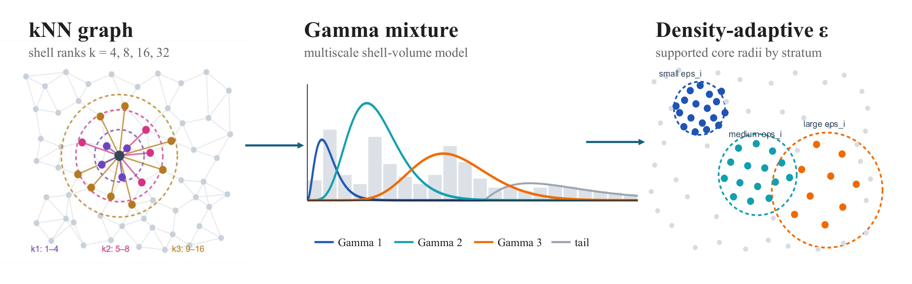
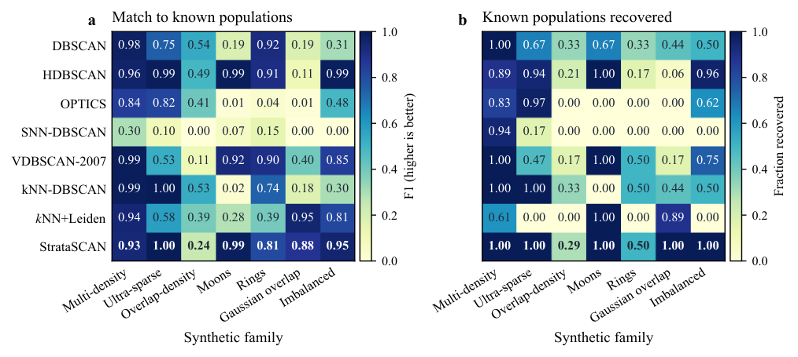
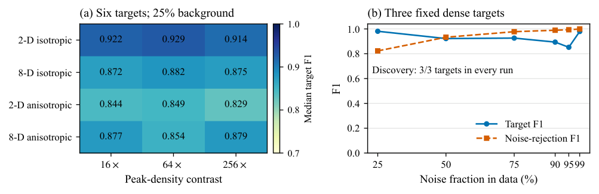
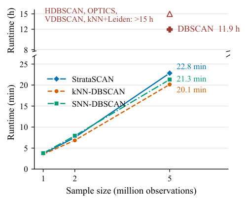

# StrataSCAN

**Adaptive Density-Stratified Clustering on Sparse kNN Graphs**

StrataSCAN finds supported groups at different local densities and leaves unsupported observations unassigned. It chooses local core scales automatically on one sparse nearest-neighbour graph, without requiring a global DBSCAN radius or a requested number of clusters.

This README follows the current article and camera-ready method explanation. The branch provides the **0.2.4 implementation**, existing experiment protocols, and curated measurements under the [MIT license](LICENSE). The executable protocols and stored results cover every experiment in the current article, including DPC-kNN and the stratification ablation.

## Why density stratification?

A dataset can contain compact populations, diffuse populations, and a much larger background. One neighbourhood radius is a difficult compromise: a small radius can break a diffuse group, while a large one can connect groups through background. **A sparse population is not automatically noise.**

StrataSCAN first asks how a point's neighbourhood changes as it expands. Similar neighbourhood profiles define density strata. A stratum is still not a cluster: spatially separate groups can have similar density, so connectivity and evidence for a supported core are checked separately. The initial background is also searched for locally supported structure.



## Install

Use **Python 3.11 or newer**. From a terminal:

```bash
git clone --branch publication/oedm2026-article --single-branch https://github.com/VEK239/StrataSCAN.git
cd StrataSCAN
python -m venv .venv
```

Activate the environment with `.venv\Scripts\Activate.ps1` on Windows PowerShell, or `source .venv/bin/activate` on Linux/macOS. Then:

```bash
python -m pip install -e .
```

For optional FAISS neighbour search, install `python -m pip install -e ".[perf]"`. FAISS availability depends on your platform. The core installation also works without it. This branch is installed from source; the instructions do not require a PyPI release.

## Quick start

This self-contained example uses the same input construction as the existing public API test:

```python
import numpy as np
from stratascan import StrataSCAN

rng = np.random.default_rng(42)
X = np.vstack([
    rng.normal(-3.0, 0.25, size=(160, 4)),
    rng.normal(3.0, 0.25, size=(160, 4)),
    rng.uniform(-8.0, 8.0, size=(180, 4)),
]).astype(np.float32)

model = StrataSCAN(backend="brute").fit(X)
labels = model.labels_
print(model.n_clusters_)
print("Rejected points:", np.count_nonzero(labels == -1))
```

`X` is a finite numeric array with shape `(n_samples, n_features)`, at least one feature, and **more than 32 rows** with the default `k=32`. Distances are Euclidean. Choose feature scaling appropriate to your data before fitting; the estimator does not automatically normalize features.

Labels `0, 1, ...` identify clusters; **`-1` means noise / abstention**. Cluster numbers have no ordering or identity across separate fits. `fit_predict(X)` directly returns the labels. Fitted attributes include `labels_`, `n_clusters_`, `core_sample_indices_`, `stratification_`, and `profile_`. `StrataSCAN` is an alias of `OptimizationStrataSCAN`. The API fits the supplied observations; it does not provide an out-of-sample `predict` method.

## How the algorithm works

1. **Look at several neighbourhood sizes.** Build one graph with 32 neighbours per observation. Distances at ranks 4, 8, 16, and 32 describe both the immediate surroundings and what happens farther away.
2. **Measure what each expansion adds.** Shell volumes between successive radii express how much extra space is needed to reach the next neighbours. A local homogeneous-Poisson model motivates Gamma distributions for those volumes.
3. **Identify density strata.** Fit a Gamma mixture to the multiscale profiles and select its order with semantic ICL. The deterministic search starts at up to eight bases and expands by four to a bound of 24. A largest-log-rate-gap split identifies candidate strata and an initial lower-density background group. This split is a modelling heuristic, not a unique physical boundary.
4. **Select a supported core scale within each stratum.** Sweep observed fourth-neighbour-distance events. Neighbour slots 1–4 construct candidate components; slots 5–8 score their internal connectivity separately. Exact distance ties are evaluated together.
5. **Retain components with positive description gain.** Combine evidence that points belong to signal, evidence of internal connectivity, and a cost for describing the selected structure.
6. **Give the initial background a second chance.** Check whether a connected group is unusual among comparable background windows and whether it has local density contrast with its surroundings. Retain it only when the combined evidence exceeds its description cost; remove accepted components and repeat.
7. **Grow clusters from denser to sparser strata.** Earlier cluster identities are preserved. Lower-density growth can extend them but cannot merge them. A border point attaches through a labelled neighbour only within that neighbour's selected core radius; otherwise it remains unassigned.

The central idea is:

$$
\mathrm{gain}=\mathrm{density\ evidence}+\mathrm{connectivity\ evidence}-\mathrm{description\ cost}.
$$

All terms use natural logarithms and are expressed in nats. **`gain > 0` means the evidence exceeds the specified cost.** It is an MDL-inspired composite criterion, not a calibrated significance test. The complete algorithm makes decisions in stages; it does not claim a global optimum of one joint objective.

The [release defaults](benchmarks/protocols/release_defaults.json) record the implemented settings. `GammaMDLConfig` and `OptimizationStrictCoreConfig` expose the modelling and extraction stages. Explicitly named older classes remain for compatibility; `StrataSCAN` selects the current implementation.

## Performance and reproducibility

`backend="auto"` uses exact KD-tree search for up to two features, FAISS HNSW for higher dimensions when FAISS is installed, and exact brute-force search otherwise. Optional dependencies therefore change the neighbour graph selected by `auto`. Choose an explicit backend when comparing runs; the example uses `brute` for a small exact calculation. HNSW is approximate, and brute-force search can be expensive for large inputs. `n_jobs=1` is the default.

The first fit can include Numba compilation time. Timings depend on hardware, package versions, neighbour backend, and warm-up. Record these when making comparisons. If reusing a graph with `fit_from_graph`, pass the feature dimension explicitly as `ambient_dimension=X.shape[1]`.

The package version is **0.2.4**. The inherited `profile_["algorithm_version"]` field still reports the **0.2.3 family identifier**; it is not a package-version check. This metadata is preserved with the article implementation.

## Results in the current article

### Heterogeneous synthetic structure

The main panel evaluates seven synthetic families at **20,000 observations with three seeds per family**: 21 cells per method. StrataSCAN completes all 21 and obtains mean Hungarian-matched target F1 **0.828** and discovery rate **0.827**. It has the highest mean target F1 among methods completing the full panel under the same resource limits; the best method varies by family.

**AMD-DBSCAN is included in the comparison.** Its mean target F1 is **0.843 over its 12 successful cells out of 21**. That conditional mean covers a different subset and cannot be ranked directly against a complete-panel mean. Failed runs remain in completion denominators and are not replaced with artificial F1 values.



Targets are matched one-to-one with predicted clusters by Hungarian assignment; unmatched targets receive zero. Target discovery requires purity at least **0.90** and coverage at least **0.10**. The [evaluation contract](benchmarks/evaluation_protocol.v1.json) defines the exact scoring rules.

### Density contrast and rare targets

The density-contrast experiment tests six equal-mass targets under 16–256-fold contrasts in 2D/8D and isotropic/anisotropic settings. All **36 StrataSCAN runs** finish; median target F1 spans **0.829–0.929**. This is a StrataSCAN capability test, not an all-method superiority test.

A separate experiment keeps three dense 100-point targets fixed while low-density background increases from **25% to 99%**. StrataSCAN discovers all three targets in every run. At 99% background, median target F1 is **0.979** and true-background F1 is approximately **1.000**. Finding targets and rejecting the unsupported remainder are separate requirements.



### Million-point execution

On the **16-D ultra-sparse family with 95% background**, the focused comparison uses one CPU and a **15-hour timeout**. At five million observations:

| Method | Recorded runtime |
| --- | ---: |
| StrataSCAN | 22.83 min |
| kNN-DBSCAN | 20.14 min |
| SNN-DBSCAN | 21.31 min |
| DBSCAN | 11.95 h |
| HDBSCAN, OPTICS, VDBSCAN-2007, kNN+Leiden | >15 h; right-censored |



These are descriptive measurements for this family and resource budget. They do not establish that StrataSCAN is universally fastest. StrataSCAN also completes all seven synthetic families through five million observations. The family-wide runs and the focused comparison have separate recorded resource budgets.

### Three independent cytometry benchmarks

The main biological comparison now uses **Levine, Mosmann, and Nilsson**. Marker panels undergo benchmark-specific arcsinh transformation and robust scaling; Mosmann uses seven type and seven state markers.

| Dataset | StrataSCAN target F1 |
| --- | ---: |
| Levine | 0.190 |
| Mosmann | 0.565 |
| Nilsson | 0.517 |
| Median across the three datasets | **0.517** |

StrataSCAN obtains the highest target F1 among completed runs on each of these three datasets in the evaluated generic-method comparison. Broader claims about biological clustering require broader evidence. Reference-negative events are not necessarily physical noise; agreement with abstention is a diagnostic.

### Additional comparison and ablation

The article also evaluates **DPC-kNN with automatic gap-based centre selection**, fixed `p=0.02`, no true cluster count, and no manual decision graph. Its canonical assignment has no noise label. The single stratification ablation processes all non-background observations as one density layer: mean target F1 changes from **0.828 to 0.735**, and discovery from **0.827 to 0.687**. It tests stratification within the complete pipeline; it does not isolate every stage's contribution.

DPC-kNN obtains mean target F1 **0.116** and discovery **0.071**, completing 21/21 main-panel cells. Its existing implementation is in `baselines/dpc_knn.py`; the ablation uses the existing `signal_strata="single_layer"` option. Both come from the experimental source branch, with their recorded results and runnable protocols included here. See [benchmark instructions](benchmarks/README.md) and [recorded evidence](results/README.md) for the included material.

## Limits

Global background burden differs from local target–background density overlap. Density overlap can defeat the initial semantic split, the component search can reach its bound, and execution can exceed available memory. Approximate neighbour graphs can change results. Background-recovery scores do not provide a guaranteed false-discovery rate. The core-scale search is exact only within its conditional candidate space.

## Repository map

| Path | Contents |
| --- | --- |
| `src/stratascan/` | Article implementation and its existing compatibility modules |
| `baselines/` | Existing controlled comparator implementations |
| `benchmarks/` | Data loaders, evaluator, runner, and named experiment protocols |
| `results/` | Curated measurements, summaries, and checksums |
| `assets/` | Figures rendered from the final article figures |
| `tests/` | Existing algorithm, neighbour, baseline, and evaluation tests |

Synthetic data are generated by the existing loaders. Primary biological data are external; see [data preparation](benchmarks/README.md#external-data). There is one source tree: reproduction uses the same code and protocols, without a duplicate snapshot directory.

## Development

```bash
python -m pip install -e ".[dev,benchmark]"
python -m pytest
python -m build
```

The optional `[perf]` extra enables tests and experiments that use FAISS. The figures belong to the article experiment evidence; the manuscript itself is not distributed in this branch.
